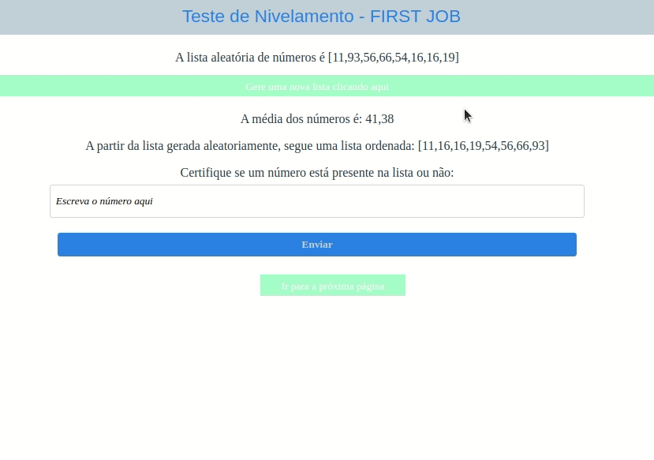

# Fisrt Job - Teste de Nivelamento

**Aplicação Web com Ordenação, Busca e Recomendação**

A aplicação web foi desenvolvida em JavaScript, realiza várias tarefas, incluindo a geração de uma lista de números aleatórios, a ordenação desses números e a média deles, a busca por um número específico e a implementação de um sistema de recomendação de produtos para um e-commerce. Abrange as questões 11,12 e 14 do teste ofernecido.

1. Página da Lista

1.1. Geração e Ordenação da Lista:
O componente ListPage gera uma lista de 8 números aleatórios e os exibe.
Ele utiliza a função quickSort para ordenar os números em ordem crescente.

1.2. Cálculo da Média:
A média dos números gerados é calculada e exibida na página.

1.3. Busca Binária:
Os usuários podem inserir um número e verificar se ele está presente na lista ordenada usando um algoritmo de busca binária.
O resultado da busca é exibido na página.

1.4. Interação do Usuário:
Os usuários podem gerar uma nova lista aleatória clicando no botão "Gere uma nova lista clicando aqui".
Os usuários podem inserir um número no campo de texto e clicar em "Enviar" para verificar se ele está na lista.

1.5. Navegação:
Os usuários podem navegar para a próxima página clicando no link "Ir para a próxima página".

2. Página de Recomendação

2.1. Recomendação de Produtos:
O componente RecommendationPage exibe um conjunto de produtos com imagens e categorias.
Os usuários podem clicar em uma imagem de produto para ver recomendações da mesma categoria.

2.2. Interação do Usuário:
Quando um usuário clica na imagem de um produto, a aplicação recomenda outros produtos da mesma categoria(produtos dourados ou pratas).

2.3. Navegação:
Os usuários podem retornar à página principal clicando no link "Voltar para a página inicial".

**Tecnologias Utilizadas**

React+Vite: A aplicação web é construída com React para o front-end.

Styled-components: A estilização é feita com styled-components para uma interface de usuário visualmente agradável.

React Router: O React Router é usado para a navegação no lado do cliente, permitindo a transição entre páginas.

**Iniciando**

* git clone https://github.com/luizarn/list-operations.git

* npm install
* npm run dev
* A aplicação estará acessível em um navegador da web em http://localhost:5174.

  

